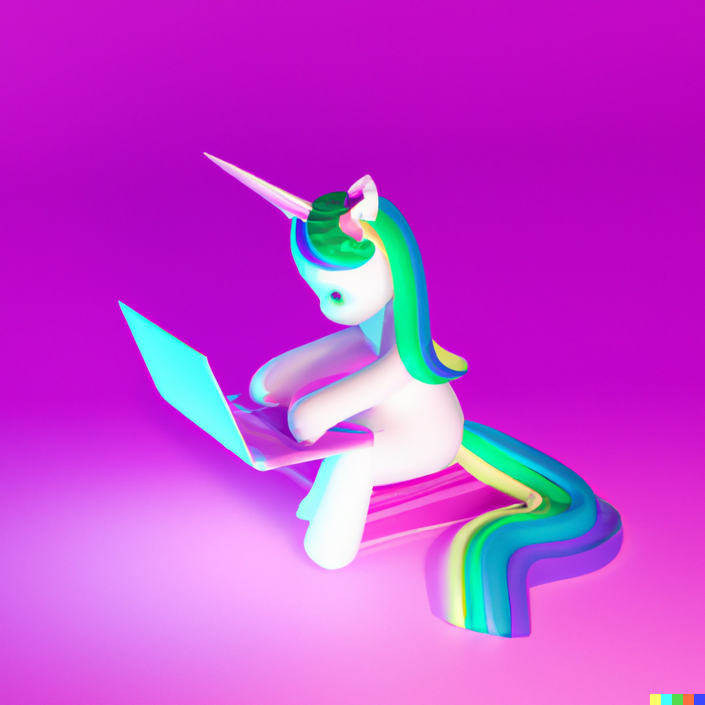

# Unicorn Rainbow

Unicorn Rainbow is a programming language full of furry functions,
witty emojies and of course 🌈🌈🌈🦄🦄🦄.

Target user is someone who is:

* 7-year old girl OR
* Someone who just want more emojis and fun in their life




## Usage

You need Leiningen to run Unicorn Rainbow.

```
git clone https://github.com/flexiana/unicorn-rainbow
cd unicorn-rainbow
lein repl
```

Within REPL run following commands:

```clojure
(use 'unicorn-rainbow.reader)
(use 'unicorn-rainbow.aliases)
```

And now, every expression in the REPL must be wrapped in `(🦄🌈 )`

Examples:
```clojure
(🦄🌈 (+ 1 🌻 2 🌹 3 🐾))

;; 6

(furry-add 2 5)

;; 7

(wowsies "Hello! 🐰🐰🐰")

;; Hello! 🐰🐰🐰

```

## License

Copyright © 2023

This program and the accompanying materials are made available under the
terms of the Eclipse Public License 2.0 which is available at
http://www.eclipse.org/legal/epl-2.0.

This Source Code may also be made available under the following Secondary
Licenses when the conditions for such availability set forth in the Eclipse
Public License, v. 2.0 are satisfied: GNU General Public License as published by
the Free Software Foundation, either version 2 of the License, or (at your
option) any later version, with the GNU Classpath Exception which is available
at https://www.gnu.org/software/classpath/license.html.
